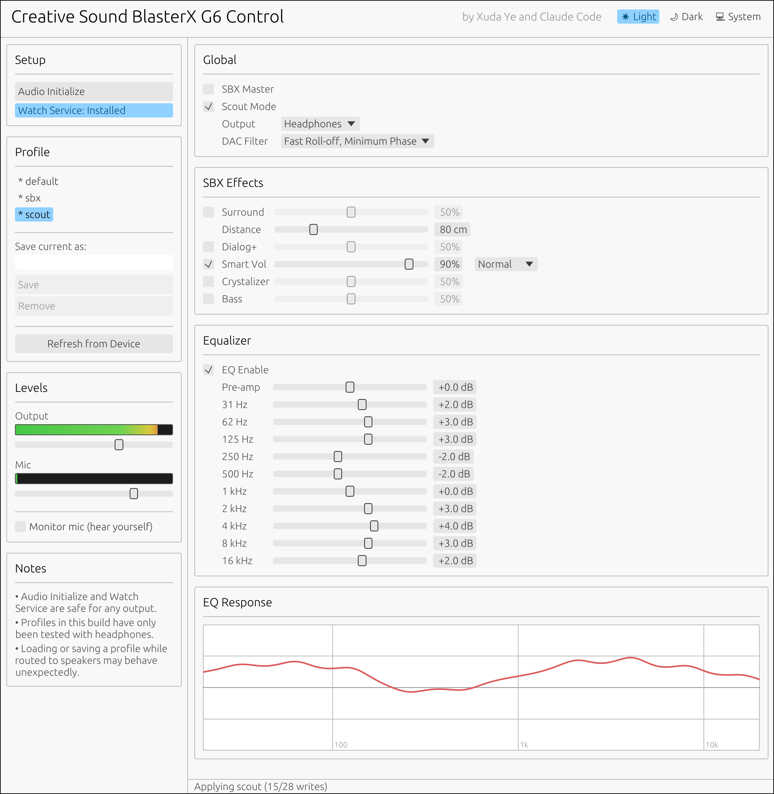

# Sound BlasterX G6 Control

[English](README.md) | [简体中文](README_SC.md)

A Linux controller for the [Creative Sound BlasterX G6](https://www.amazon.com/BlasterX-External-Surround-Sidetone-Consoles/dp/B0G6DS1RZV) (USB `041e:3256`). Ships
a CLI (`g6-cli`) and a small native GUI (`g6-gui`).

> **Arch Linux only.** This project is developed and tested on Arch with both
> Hyprland (Wayland) and LXQt (X11), both with PipeWire-Pulse. The supported
> install path is `makepkg -si` against the bundled [PKGBUILD](PKGBUILD) — which pulls
> every build and runtime dependency through pacman. Other distros are
> untested; if you build from source on one, you are on your own for system
> libraries (libusb, libudev, Wayland, X11, libxkbcommon,
> libxkbcommon-x11, mesa, fontconfig, alsa-utils, libpulse, polkit + an
> authentication agent) and toolchain (Rust ≥ 1.85 for edition 2024).



---

## How it works

The G6 is two devices wearing one USB shell:

- A **USB Audio Class** interface for raw PCM playback/capture — the kernel
  handles this with no driver. Volume, mute, and sample-rate selection just
  work through ALSA / PipeWire / `pavucontrol`.
- A **vendor HID interface** (interface 4) that the on-board DSP listens on.
  Everything the Windows-only Sound Blaster Command app changes — SBX effects,
  10-band EQ, output mode, DAC filter — travels over this interface as small
  binary command packets. Linux has no driver for it.

`g6-cli` and `g6-gui` speak that vendor protocol directly via `hidapi`. A
**profile** is a JSON snapshot of all 28 features the DSP exposes; loading a
profile is just writing each feature in order. Three profiles (`default`,
`scout`, `sbx`) are baked into the binary and always available; anything you
`save` lives under `~/.config/sound-blasterx-g6-control/`.

The CLI also handles the small ALSA / PipeWire chores that aren't really about
the DSP but always trip up first-time users — selecting *External Mic* as the
capture source, making the G6 the default sink/source, and (optionally)
pinning the mic choice across PulseAudio resyncs via a tiny systemd user
service.

## Install (Arch)

One-line install via an AUR helper (recommended):

```sh
yay -S sound-blasterx-g6-control-git
```

Or clone and `makepkg` yourself:

```sh
git clone https://github.com/xuda-ye-math/Sound-BlasterX-G6-Control.git
cd Sound-BlasterX-G6-Control
makepkg -si
```

Either path reads [PKGBUILD](PKGBUILD), pulls every build and runtime
dependency through pacman, compiles the workspace with `cargo`, and installs:

- `/usr/bin/g6-cli`, `/usr/bin/g6-gui`
- `/etc/udev/rules.d/91-soundblaster-g6.rules` (so user-mode HID access works
  without sudo from the moment the package is installed)
- `LICENSE` and this README under the standard `/usr/share/` paths

No `cargo`, `rustup`, or hand-installed system libraries needed.

## First-time setup

Plug the G6 in and run `g6-cli init` once. It checks the card is enumerated,
points ALSA / PipeWire at it, and confirms the udev rule is in place. If you
installed via `makepkg -si`, the udev rule is already shipped by the package,
so `init` will just confirm it and skip the sudo prompt.

```sh
$ g6-cli init
device:   Sound BlasterX G6 detected
alsa:     capture source = External Mic @ 100%
pipewire: sink   -> alsa_output.usb-Creative_Technology_Ltd_Sound_BlasterX_G6_100054476FX-00.analog-stereo
pipewire: source -> alsa_input.usb-Creative_Technology_Ltd_Sound_BlasterX_G6_100054476FX-00.analog-stereo
udev:     rule already installed at /etc/udev/rules.d/91-soundblaster-g6.rules
hint:     if you don't use pavucontrol, you're done.
          if you do, run `g6-cli service install` once to keep External Mic across PA resyncs.
```

If you use `pavucontrol` (or anything else that resyncs PulseAudio card
profiles), also run `g6-cli service install` — it drops a systemd user unit
that re-pins *External Mic* on every PA card/source event.

Now (optionally) apply a profile:

```sh
g6-cli load scout         # or: default | sbx | -n <your-saved-name>
```

## Usage

### CLI

```sh
g6-cli status                 # current device state as a table
g6-cli status --json          # same, JSON (for scripts)

g6-cli load scout             # apply a built-in preset (default | scout | sbx)
g6-cli load -n myprofile      # apply a custom profile
g6-cli save -n myprofile      # snapshot current state to ~/.config/sound-blasterx-g6-control/myprofile.json
g6-cli list                   # all profiles (* = built-in, protected from remove)
g6-cli remove -n myprofile    # delete a custom profile

g6-cli set Eq1kHz 4.5         # tweak one feature live (dB for EQ bands)
g6-cli set SbxMaster 1        # toggle on/off (1 / 0)
g6-cli get SurroundLevel      # read one feature

g6-cli test speaker           # play Front_Left / Front_Right reference clips
g6-cli test mic -t 3          # record 3 s from default source, then play it back
```

User-defined profiles are stored as plain JSON in
`~/.config/sound-blasterx-g6-control/` (one file per profile, e.g.
`myprofile.json`). The three built-ins (`default`, `scout`, `sbx`) are baked
into the binary and don't appear on disk. The directory respects
`$XDG_CONFIG_HOME` if set; back it up, sync it across machines, or hand-edit
the JSONs freely.

`g6-cli --help` and `g6-cli <subcommand> --help` list every option.

### GUI

```sh
g6-gui
```

The GUI supports both native Wayland sessions (including Hyprland) and X11
sessions (including LXQt). It selects the available display backend at launch.

Sliders apply on release; checkboxes and dropdowns apply immediately. The
sidebar holds four cards: **Setup** (Audio Initialize, single toggle button
for the Watch Service), **Profile** (built-in + saved profiles, save/remove),
**Levels** (live OBS-style output/mic meters with peak-hold, plus direct
volume sliders that drive `pactl set-sink-volume` / `set-source-volume` and
update automatically when you press keyboard volume keys or open pavucontrol),
and **Notes**. Below the Equalizer in the main panel, an **EQ Response**
plot draws the summed peaking-EQ curve live as you move the 10 band sliders
and the pre-amp, so you can see the resulting frequency response without
running an external tool. Setup actions run `g6-cli` in the background and
pop up a result modal when finished (a polkit prompt may appear first).

## Autostart on login

Have your session run this once at startup:

```sh
sleep 5 && g6-cli init --no
```

- `sleep 5` gives PipeWire and the G6 ALSA card time to enumerate (otherwise
  `init` race-bails on `/proc/asound/cards`).
- `--no` skips the interactive udev-install prompt, which has no stdin in a
  detached session. Once the rule is installed (it is, after `makepkg -si`),
  `--no` and `--yes` behave identically — the check early-returns.
- If the G6 isn't plugged in at login, `init` exits non-zero before touching
  anything; safe to leave in place permanently.

How to wire it in:

- **Hyprland** — add to `~/.config/hypr/hyprland.conf`:
  ```
  exec-once = sleep 5 && g6-cli init --no
  ```
- **GNOME / KDE** — drop `~/.config/autostart/g6-cli-init.desktop`:
  ```ini
  [Desktop Entry]
  Type=Application
  Name=Sound BlasterX G6 init
  Exec=sh -c 'sleep 5 && g6-cli init --no'
  X-GNOME-Autostart-enabled=true
  ```

## Limitations and roadmap

**Not handled** — these live in other protocol layers, each its own driver:

- **Hardware buttons** (kernel hidraw events)
- **RGB lighting** (separate vendor RGB protocol)
- **Direct Mode bypass** of the DSP

**Tested only with headphones.** The G6 firmware keeps separate DSP slots per
output, and the bundled `default`/`sbx`/`scout` JSONs were captured under the
headphone slot. Loading them while routed to speakers may behave unexpectedly
— `save` a known-good speaker state first.

**Sample rate is fixed at 48 kHz.** Higher rates (96 kHz, 192 kHz) are not
supported yet — the vendor command that switches the G6's internal sample
clock hasn't been reverse-engineered, so anything you set in PipeWire above
48 kHz currently gets resampled on the host instead of running natively.

**Tested on Arch with Hyprland (Wayland) and LXQt (X11), both using
PipeWire-Pulse.** The GUI is built with both display backends. The polkit
agent probe in [`crates/g6-cli/src/main.rs`](crates/g6-cli/src/main.rs) covers
the common GNOME / KDE / MATE / LXQt / Hyprland agents, but exotic
compositors may need their agent name added.

**Roadmap:** first-class speaker profile set (validated by ear + spectrum),
optional RGB control as a separate opt-in crate, Direct Mode toggle.

## Credits

By Xuda Ye and Claude Code. MIT licensed.

This project owes a lot to
[RizeCrime/linuxblaster_control](https://github.com/RizeCrime/linuxblaster_control),
whose reverse-engineering of the G6's vendor HID protocol — the command
opcodes, feature IDs, and packet layouts — is what made `g6-cli` and `g6-gui`
possible.
